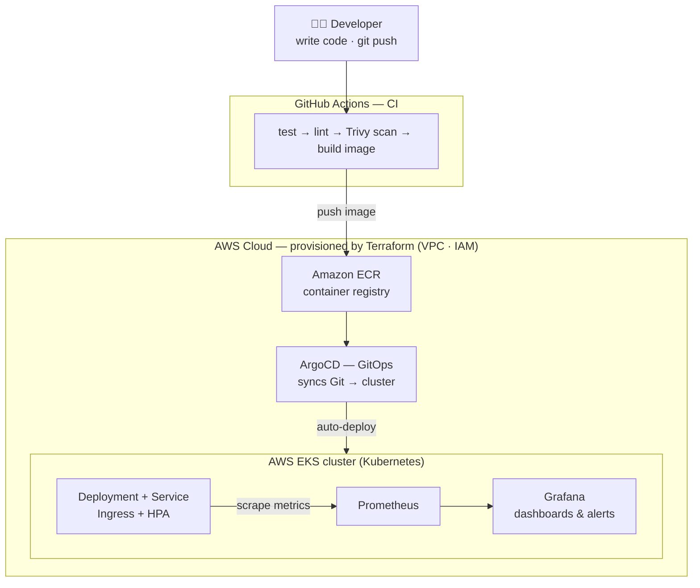

# Cloud-Native CI/CD Platform on AWS EKS

[](https://github.com/KartikNaphade2004/cloud-native-cicd-eks/actions/workflows/ci.yaml)
[](https://github.com/KartikNaphade2004/cloud-native-cicd-eks/actions/workflows/security.yaml)
[](LICENSE)


An end-to-end DevOps project demonstrating the full software delivery lifecycle:
a containerized Python (FastAPI) microservice built, tested, scanned, and shipped
through GitHub Actions, provisioned on **AWS EKS** with **Terraform**, deployed via
**GitOps (ArgoCD)**, and observed with **Prometheus + Grafana**.

> Built as a portfolio project to showcase production-grade DevOps practices.
> **▶ Full end-to-end demo runbook: [docs/DEMO.md](docs/DEMO.md)**

## Architecture



**Flow:** you push code → CI tests, scans, and builds a container → the image lands in
Amazon ECR → ArgoCD notices and deploys it to the EKS cluster → Prometheus scrapes
metrics and Grafana visualizes them. No manual steps after `git push`.

## Tech stack

| Layer          | Tool                          |
|----------------|-------------------------------|
| Application    | Python (FastAPI + Prometheus) |
| Containers     | Docker (multi-stage)          |
| CI             | GitHub Actions                |
| Registry       | Amazon ECR                    |
| IaC            | Terraform                     |
| Orchestration  | AWS EKS (Kubernetes)          |
| CD / GitOps    | ArgoCD                        |
| Observability  | Prometheus + Grafana          |
| Security       | Trivy + Checkov (image, deps, IaC) |

## Repository layout

```
.
├── app/            # Python (FastAPI) microservice + tests + Dockerfile
├── .github/        # CI + security workflows, Dependabot
├── infra/          # Terraform: VPC, EKS, ECR, GitHub OIDC/IAM
├── k8s/            # Kubernetes manifests (Kustomize base + overlays)
├── argocd/         # ArgoCD Applications (app-of-apps)
├── monitoring/     # Prometheus + Grafana + alerts
├── docs/           # End-to-end demo runbook
└── Makefile        # Common commands (run `make help`)
```

## Build phases

- [x] **Phase 1** — App, Docker, CI pipeline
- [x] **Phase 2** — Terraform infra (VPC, EKS, ECR, GitHub OIDC)
- [x] **Phase 3** — Kubernetes manifests (Kustomize base + dev/prod overlays)
- [x] **Phase 4** — GitOps with ArgoCD (app-of-apps)
- [x] **Phase 5** — Monitoring (Prometheus + Grafana + alerts)
- [x] **Phase 6** — Polish, badges, LICENSE, DevSecOps (Trivy/Checkov), demo runbook

**✅ All phases complete.** See **[docs/DEMO.md](docs/DEMO.md)** to run the whole
thing end-to-end on AWS.

## Cost control

EKS incurs cost while running (~$0.10/hr control plane + node costs). Provision
only when demoing:

```bash
make infra-up      # terraform apply
make infra-down    # terraform destroy  — run when done to stop billing
```

## Quick start (local)

```bash
make install       # install Python deps (use a virtualenv)
make run           # run the app locally on :8080
make test          # run tests
make docker-build  # build the container image
curl localhost:8080/healthz
curl localhost:8080/metrics
```
